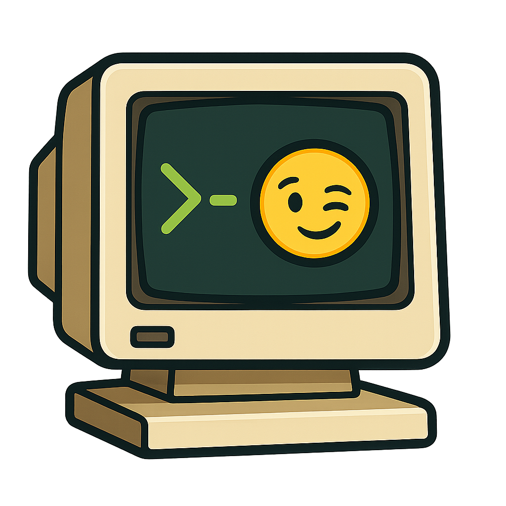
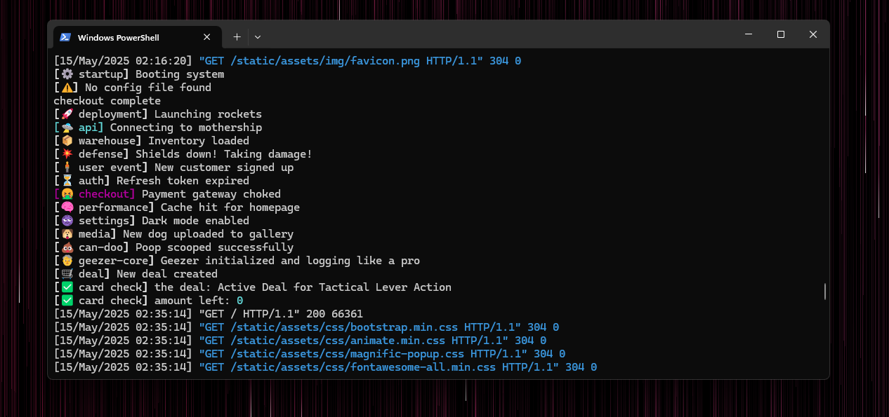

<table>
<tr>
<td>

# Geezer

**Old-school logging for stylish Python devs.**  
Built with Django in mind — but works anywhere `print()` does.

Use `print()` with ✨ taste and purpose — with color, emoji, and style.

<p>
  <a href="https://pypi.org/project/geezer/"></a>
  
  
  
</p>

</td>
<td align="right" width="250">



</td>
</tr>
</table>

---


## What is Geezer?

Geezer is a tiny Python logging helper that makes print-style debugging stylish, readable, and safe for dev environments.

Perfect for:
- Teaching or explaining complex code
- Debugging step-by-step logic
- Visual learners or neurodivergent-friendly workflows
- Looking good in the terminal 😎

It hides noise in production — unless you say otherwise.

*Note:* Geezer is purely a developer print helper, not a full logging framework. You won't find sinks, handlers, or JSON adapters here—just simple, explicit tools to help you track what your code is doing.

---

## 🖥️ Terminal Support

Geezer looks best in terminals that support:

- **UTF-8** (for emoji output)
- **ANSI colors** (used by [`rich`](https://github.com/Textualize/rich))

✅ Recommended:
- Windows Terminal  
- macOS Terminal or iTerm2  
- Any modern Linux terminal  

⚠️ *Note:* PyCharm's terminal or legacy consoles may not render colors or emojis properly. Use an external terminal for full effect.

---

## Install

```bash
pip install geezer
```

📦 PyPI: [https://pypi.org/project/geezer/](https://pypi.org/project/geezer/)

---

## Usage

### ✅ Basic logging
```python
from geezer import log, warn

log("Booting system", emoji="⚙️", label="startup")
```

### ✅ Custom print / log name
```python
from geezer import log as prnt

prnt("Loading NIBBLES.BAS", emoji="🐍", label="games")
```

### ⚠️ Warnings
```python
warn("No config file found", label="config check")
```

### 🏷️ Tags & Emojis
```python
log("Launching rockets", emoji="🚀", label="deployment")
log("Inventory loaded", emoji="📦", label="warehouse")
log("Shields down! Taking damage!", emoji="💥", label="defense")
log("Poop scooped successfully", emoji="💩", label="can-doo")
```

## 📦 Dynamic Logging

Just like `print()`, you can log variables — but you **must** use an f-string or string concatenation to include dynamic content.

### ✅ Using f-strings

```python
snake_count = 3
log(f"User has {snake_count} snakes left", emoji="🐍", label="reptile-room")
```

### ✅ Multiple variables

```python
user = "ben"
count = 7
log(f"{user} collected {count} tickets", emoji="🎟️", label="cinema")
```

### ❌ Don’t do this:

```python
log("User has", emoji="🐍", label=snake_count)  # ❌ This won't work like you expect
```


---

## More fun examples

```python
log("Connecting to mothership", emoji="🛸", label="api")
log("New customer signed up", emoji="🧍", label="user event")
log("Refresh token expired", emoji="⏳", label="auth")
log("Cache hit for homepage", emoji="🧠", label="performance")
log("Dark mode enabled", emoji="🌚", label="settings")
log("New dog uploaded to gallery", emoji="🐶", label="media")
log("Geezer initialized and logging like a pro", emoji="🧓", label="geezer-core")
log("New deal created", emoji="🛒", label="deal")
```

---

## Output Example

```text
[🛒 checkout] Starting checkout for user 42  
[✅ card validation] Card info validated  
[🔌 payment gateway] Calling Fortis API...  
[💰 payment] Transaction approved for $49.99  
[➡️ redirect] Redirecting to receipt page  
```

Styled with [rich](https://github.com/Textualize/rich) under the hood.


<p align="center">
  
</p>


---

## ✨ Features

### 🟡 `warn()`
```python
warn("User has no saved card", label="user check")
```

---

## Config

By default, `geezer` only prints in dev:
```env
DJANGO_DEBUG=True
```

Or override manually using the `force=True` flag.

---

## Why “Geezer”?

Because sometimes the old ways are the best.  
Geezer gives you raw, readable feedback — with zero setup, and max personality.

---

## Roadmap

- [x] Console styling with `rich`  
- [x] Utility functions (`warn`)
- [x] Emoji + label tagging  
- [ ] Framework agnostic setting for when to show geezer prints in production or dev

---

Pull up a chair.  
Throw in a `prnt()` or `log()`.  
Talk to yourself a little.

You earned it, geezer.
